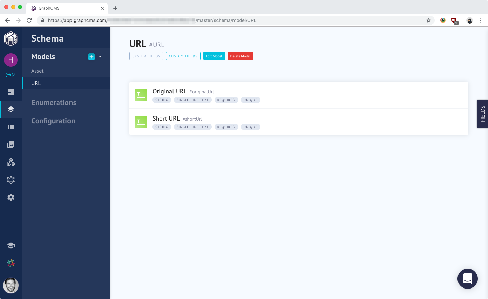

# URL Shortener

GraphQL + Vue.js 

## Setup

1. Create a `URL` schema for [GraphCMS](https://graphcms.com/), with `originalURL` and `shortURL` fields.
2. Replace `YOUR_GRAPHCMS_ENDPOINT` and `YOUR_PERMANENT_AUTH_TOKEN` in `src/main.js`.
2. Run `npm install` and `npm run serve`.

